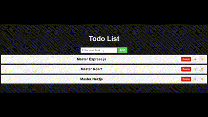

# React Todo List App

A simple and interactive Todo List application built with ReactJS. This app allows you to add, delete, and reorder tasks using move-up and move-down buttons.

## Features

- **Add Task**: Easily add new tasks to your list.
- **Delete Task**: Remove tasks that are no longer needed.
- **Reorder Tasks**: Move tasks up or down to prioritize them according to your needs.
- **Responsive Design**: Clean and user-friendly interface with responsive design.

## Technologies Used

- **ReactJS**: The core library for building the user interface.
- **JavaScript (ES6+)**: Logic and functionality.
- **CSS**: Basic styling of the app.

## How to Use

1. **Run the App**: Start the app by running it locally or deploying it to a hosting service.
2. **Add a Task**: Type your task in the input field and click the 'Add' button to add it to the list.
3. **Delete a Task**: Click the 'Delete' button next to the task to remove it from the list.
4. **Reorder Tasks**: Use the up (☝️) and down (👇) arrows to move tasks within the list.

## Installation

To run this project locally:

1. **Clone the Repository**:

   ```bash
   git clone https://github.com/Adlichalbi/todo-list.git
   ```
2. **Navigate to the Project Directory:**
```bash
   cd todo-list 
```
3. **Install Dependencies:**
Make sure you have Node.js installed, then run:
```bash
   npm install
 
```
4. **Run the App:**
```bash
   npm run dev
```
The app will open in your default web browser.

## Component Structure
* `TodoList.jsx`: Main component containing the task management logic, including adding, deleting, and moving tasks up or down.

### Code Snipets
**Adding a Task**
```js
function addTask() {
  if (!newTask.trim()) return; // Check if newTask is empty
  setTasks((previousTasks) => [
    ...previousTasks,
    newTask,
  ]);
  setNewTask("");
}
```

**Moving a Task Up**
```js
function moveTaskUp(index) {
  if (index > 0) {
    const updatedTasks = [...tasks];
    [updatedTasks[index], updatedTasks[index - 1]] = [
      updatedTasks[index - 1],
      updatedTasks[index],
    ];
    setTasks(updatedTasks);
  }
}
```


**Moving a Task Down**
```js
function moveTaskDown(index) {
  if (index < tasks.length - 1) {
    const updatedTasks = [...tasks];
    [updatedTasks[index], updatedTasks[index + 1]] = [
      updatedTasks[index + 1],
      updatedTasks[index],
    ];
    setTasks(updatedTasks);
  }
}
```

## Screenshots (Gif)



### License
This project is licensed under the MIT License. 

## Contributing
Contributions are welcome! Please fork this repository and submit a pull request if you'd like to make improvements or add features.

## Contact
For any questions or feedback, please contact [Adli Chalbi](https://github.com/Adlichalbi).

